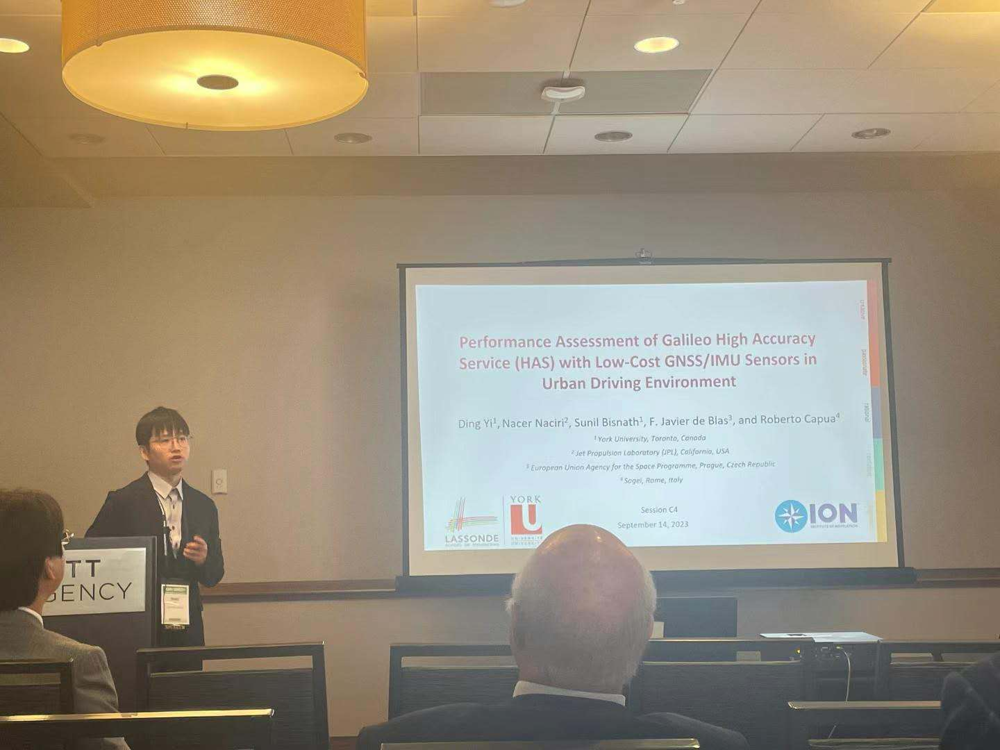

<figure style="text-align: center;">
  
  <figcaption>
    <em>Best student paper award</em>
  </figcaption>
</figure>

I participated in **ION GNSS+ 2023**, held in Denver, USA, where I presented **two conference papers** focusing on smartphone-based GNSS positioning and multisensor integration in realistic driving environments.

The first paper, **“Hybridization of Smartphone GNSS PPP/RTK with Native IMU in Realistic Driving Scenarios”**.

This paper received the **ION GNSS+ 2023 Student Paper Award**, a highly competitive international award granted annually to only **4–5 papers worldwide**, recognizing outstanding student-led research contributions.

<figure style="text-align: center;">
  
  <figcaption>
    <em>Paper award</em>
  </figcaption>
</figure>

🔗 Paper link:  
[Hybridization of Smartphone GNSS PPP/RTK with Native IMU in Realistic Driving Scenarios](https://www.ion.org/publications/abstract.cfm?articleID=19449)

The second paper, **“Performance Assessment of Galileo High Accuracy Service (HAS) with Low-Cost GNSS/IMU Sensors in Urban Driving Environments”**.

<figure style="text-align: center;">
  
  <figcaption>
    <em>ION talks</em>
  </figcaption>
</figure>

🔗 Paper link:  
[Performance Assessment of Galileo High Accuracy Service (HAS) with Low-Cost GNSS/IMU Sensors in Urban Driving Environments](https://www.ion.org/publications/abstract.cfm?articleID=19320)